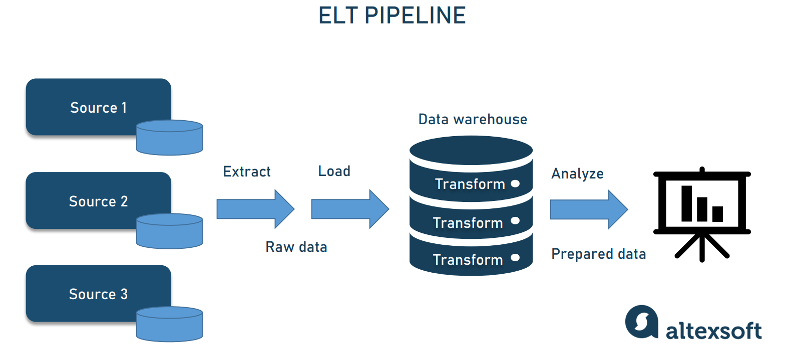

# Header (Arquivo integrado com VSCODE!) SÓ ALEGRIA!
## Header2
### Header 3
#### Header 4
 
## 1. Lista não ordenada
- Elemento 1
- Elemento 2
- Elemento 3
- Elemento 4

## 2. Lista ordenada
1. Elemento 1
2. Elemento 2
3. Elemento 3
4. Elemento 4

## 3. Enfase
*Itálico com asterisco* 

_Itálico com underline_

**Negrito com asterisco**

__Negrito com underline__

**_Negrito e itálico_** 

## 4. Links
[Google](https://www.google.com.br/)

[Spark Site](https://spark.apache.org/)

## 5. Quotes
## Onde buscar exemplos de Spark?
> O melhor site é o PySpark by examples!

## 6. Código
```
print('Hello world')
def funcao():
  a = 1
  b = 2
```

## 7. Tasklist
- [x] Comprar item1
- [ ] Comprar item2
- [ ] Comprar item3

## 8. Tabelas
| Time        | País       |
|-------------|------------|
| Real Madrid | Espanha    |
| Man. UTD    | Inglaterra |
| PSG         | França     |

- Link para gerar tabelas:

[Table generator!](https://www.tablesgenerator.com/markdown_tables)

## 9. Imagens


